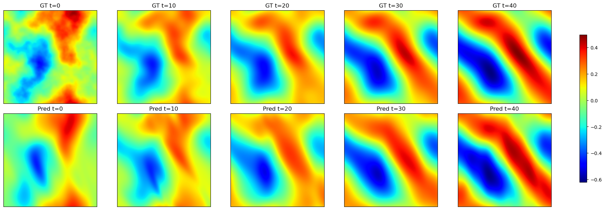

This is the course project submission for CSCI 2470, 2025 Fall semester. The title of the project is Conditional Implicit Neural Representations for Operator Learning. This is a solo project by Ruthwik Chivukula. Refer to the report for further details of the project.
* The project report has a detailed write-up about the project, building right from introducing Operator Learning to data generation pipeline, methodology, results and post-processing analysis.
* The ns_2d.py and random_fields.py are helpful for the data generation. Executing the former will create three .npy files: solutions, initial conditions, and time steps.
* data_utils.py has the relevant code for creating pytorch compatible dataset and corresponding data loaders.
* The INR codebase is my primary implementation which aims to learn a projection into the latent space and lifting it back to the physical space with minimal reconstruction loss (two methods: auto-encoder, auto-decoder and a hybrid approach)
* encoder.py contains the implementation of the CNN Encoder. decoder.py contains the implementation of the two sub-networks: Synthesis Network and Modulation Network.
* inr_wrapper.py wraps all the individual components into a single module.
* inr_train.py has the code for the training loop and the inference.py has relevant functions for model inference.
* inr_main.py orchestrates all the above mentioned files, where all the modules are called and training of the model is set to True.
* For additional post-processing, check the jupyter notebook where I do some FFT spectral analysis of the obtained results.
* The tranformer codes were tried for training the autoregressive rollout of the latent vectors. However, the results weren't satisfactory and hence, I don't pursue further analysis on it for now.

  
